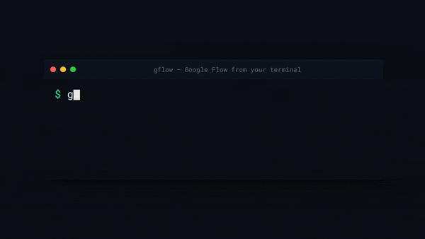

# gflow-cli — Demos

A gallery of `gflow` in action. Every clip is a **real recording** — the browser is an OBS window-capture of a live Google Flow run, the terminal is rendered to match the real CLI output. More demos land here as they're produced, so the main [README](../README.md) stays lean.

<table>
<tr>
<td width="50%" valign="top" align="center">

### Terminal → image


```bash
gflow image t2i "…" --aspect 9:16
```

A single text-to-image run: the command, gflow's streaming `structlog` output, and the PNG landing on disk. The most accessible "first win".

**Format:** 9:16 · terminal-only screen capture.

</td>
<td width="50%" valign="top" align="center">

### Split-screen — command + Flow together



```bash
gflow image t2i "a serene mountain lake at dawn"
```

Prompt-first split-screen: the command is typed on a full terminal, **then** the Flow browser slides in — you watch the prompt populate Flow's input, Imagen generate, and the image resolve. Terminal + browser in one frame.

**Format:** 16:9 · prompt-first · terminal (rendered) over Flow (OBS window-capture).

</td>
</tr>
</table>

## More formats & layouts

The split-screen demo is rendered from one clean master into several social formats and layouts (16:9 / 9:16 / 1:1; terminal-top / terminal-bottom / picture-in-picture; simultaneous and prompt-first). They live in the companion repo and are added here as they're finalized.

## Reproduce

- **Terminal → image:** [`scripts/record_demo.ps1`](../scripts/record_demo.ps1) (Windows + OBS + ffmpeg + gifski).
- **Split-screen:** rendered with [Remotion](https://www.remotion.dev/) in the companion repo [`gflow-cli-remotion`](https://github.com/ffroliva/gflow-cli-remotion), composing the rendered terminal over a clean OBS window-capture master.
