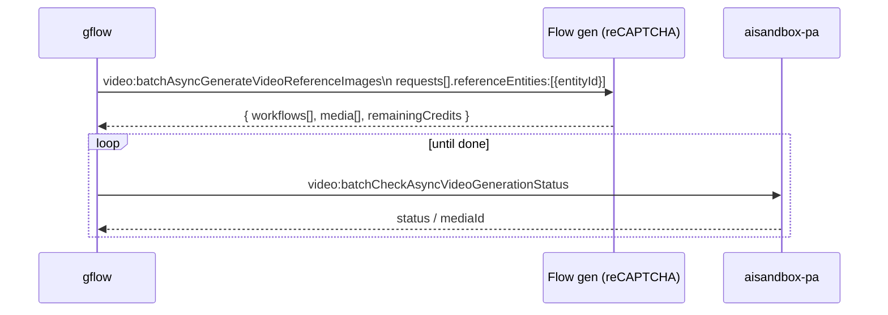

# Characters — feature spec & system design

> **Status:** SHIPPED (live-verified 2026-06-02) · **Issue:** [#145](https://github.com/ffroliva/gflow-cli/issues/145) · **Branch:** `feature/character-creation`
> **Living document.** Evolve this as the feature and Flow's API evolve. Raw capture provenance lives in
> [`CHARACTER_RECON.md`](CHARACTER_RECON.md); the cross-feature decision lens is
> [the REST-path capability matrix](#capability--cost).
> **Credit:** pattern-references @kittinan's avatar PR #123 (attach-flow idiom + CLI scaffolding shape) — but
> built **greenfield off `develop`, NOT stacked on #123** (that branch is CONFLICTING and likeness-specific;
> see [Design decisions](#11-design-decisions-post-predict)).

> **Shipped scope:** `gflow character create` + `list` + `show` + `voices` + `rm`. Name-based reuse via
> `@Name` prompt mentions is **shipped** (v0.40.0, [#344](https://github.com/ffroliva/gflow-cli/issues/344))
> for both `image` and `video` paths — see [REFERENCE_STRATEGIES](REFERENCE_STRATEGIES.md). An explicit
> `--character <id>` **flag** on `gflow video` (a separate, repeatable-ref delivery mechanism) remains
> **not yet implemented** — see [Backlog](#14-backlog--not-yet-implemented).

> **Status (2026-06-02, LIVE-VERIFIED):** the create saga + character-editor UI generation are **shipped**
> and verified end-to-end on my-profile (face + front/side/back triptych body, both reference slots bound,
> images downloaded, character read back). This document's selectors, editor URL, generation protocol
> (Option B), `flow/entities` PATCH, and the CLI surface are **VERIFIED against shipped code**, not guesses.
> The `nanopro` model picker is wired best-effort (non-fatal) and pending an explicit live confirmation — see
> [Backlog](#14-backlog--not-yet-implemented).

## 1. What it is

A **Character** is a reusable, project-scoped identity in Google Flow: a named subject with one or more
reference images (e.g. face + full-body), an optional **voice**, and an optional **personality**. Once a
character exists, it can be **reused** across generations in the same project so the same subject appears
consistently from shot to shot. This is the feature requested in #145.

`gflow` exposes this as a first-class command group, `gflow character`, plus a `--character` reuse flag on
generation commands.

### 1.1 How it works (plain language)

`gflow character create` builds a character in **two credited generation steps**, kept visually consistent by
seeding the second step with the first:

1. **Face (slot 0).** gflow submits your `--face-prompt` and Flow generates the **face** image. This becomes
   the character's first reference image.
2. **Body (slot 1).** gflow activates the editor's Create-Body mode, which **auto-attaches the just-generated
   face image as the reference seed**. gflow then submits its **own self-contained
   front/side/back triptych prompt** (it wraps your `--body-prompt` body/outfit description). Because the face
   is attached as the seed, a **single credited generation** produces all three body angles — front, side, and
   back — that match the face.

   The character editor is a **two-mode surface** ("Portrait" / "Create Body"). Current Flow reuses one Slate
   editor across both modes, so gflow anchors Create Body by the locale-independent `accessibility_new` icon
   beside the portrait-image button and requires a new generated-face reference chip to mount before using the
   shared box. Older cohorts that mount a second prompt box remain supported through a Slate-count-rise gate. In
   both cases gflow verifies the selected
   body box still owns focus **before clearing or typing**. If the structural mode signal or focus check fails,
   the body step aborts before any autosaved prompt edit; post-type isolation failures abort before the credited
   submit. This guards the race that corrupted a stored portrait prompt live on 2026-07-25/0.43.0. Re-run
   `gflow character create` to retry; the saga reuses the entity and completed face slot (§4).

The result: two generations (face + body-triptych), the body kept on-model by the face seed. Everything else —
naming the character, setting the voice/personality, and saving — is free metadata (REST), not generation. See
§4 for the full saga and §6.2 for the wire payload.

### Why this, not Avatar (#123)
Flow's **Avatar/likeness** (`referenceLikenesses`) is verified-identity + region gated —
`GET /v1/flow/likeness:checkEligibility` returns `{"ineligibilityReasons":["REGION"]}` for our accounts, so
it is **held**. **Characters** are broadly available and are the consistency primitive most users actually need.

## 2. Domain model

```
Project
└── Entity (entityType = CHARACTER)         # the Character; id = entityId, lives at /project/{projectId}/character/{entityId}
    ├── displayName                          # "Denidra"
    ├── characterInfo
    │   ├── personalityNotes                 # free text; guides behaviour when prompt is silent
    │   ├── audioReferences[] { presetVoiceId }   # voice, e.g. "Charon" (canonical = Capitalized UI name; see §7)
    │   └── imageReferences[]  { workflowId }     # face, body, … → each Workflow has a primaryMediaId
    └── thumbnailMediaId                      # the cover image
```

A Character references **Workflows**, not raw media. Each reference image is the *primary media* of a
generation **Workflow** (`workflow.metadata.primaryMediaId`), and the Workflow is bound to the Character via
`workflow.parentEntityId`. This indirection lets a reference image be re-rolled without breaking the link.

## 3. Capability & cost

Per the REST-path capability matrix, the feature is a **hybrid**: only the two *generative* calls require the
reCAPTCHA browser path and consume credits; all structural operations are free REST.

| Operation | Endpoint | Transport | reCAPTCHA | Credits |
|---|---|---|---|---|
| Mint character | `POST /fx/api/trpc/flow.createEntity` | tRPC (session) | no | no |
| Generate reference image | `POST /v1/projects/{projectId}/flowMedia:batchGenerateImages` | **Flow UI (passive-capture)** — direct POST is 403-walled | **yes** | **yes** |
| Set primary image | `PATCH /v1/flowWorkflows/{workflowId}` | Bearer REST | no | no |
| Save character | `PATCH /v1/flow/entities` | Bearer REST | no | no |
| List / show | `GET /fx/api/trpc/flow.projectInitialData` | tRPC (session) | no | no |
| Reuse in video | `POST /v1/video:batchAsyncGenerateVideoReferenceImages` | **Flow UI (passive-capture)** — reCAPTCHA-gated | **yes** | **yes** |
| Poll reuse status | `POST /v1/video:batchCheckAsyncVideoGenerationStatus` | Bearer REST | no | no |
| (optional) Archetype prompt | `POST /fx/api/trpc/flow.generateCharacterPrompt` | tRPC (session) | no | no |
| (context) Eligibility | `GET /v1/flow/likeness:checkEligibility` | Bearer REST | no | no |

Auth model per [[aisandbox-rest-needs-sapisidhash]]: aisandbox REST wants `Authorization: Bearer ya29…`
(from `GET /fx/api/auth/session`); tRPC calls ride the labs.google session cookies.

## 4. Sequence — create a character (VERIFIED, Phase-2)

The shipped saga lives in `services/character_create.py::character_create` and is **persist-before-spend +
crash-recoverable**: the recorder writes a `STARTED` row (carrying `entityId`) *before* any credited
generation, records each slot as it completes (`record_character_partial`), and only flips to `SUCCEEDED`
after the entity is saved. On a crash anywhere after `createEntity`, the next run detects the incomplete row
(`find_incomplete_character`), reuses the `entityId`, and skips any slot whose ids are already recorded — no
orphan double-charge. Generation rides Flow's own page JS in the **character editor** (Option B,
passive-capture); the structural calls are direct REST.

```mermaid
sequenceDiagram
  participant CLI as gflow character create
  participant SAGA as character_create saga
  participant REC as recorder (SQLite)
  participant BFF as labs.google (tRPC)
  participant API as aisandbox-pa (Bearer REST)
  participant UI as Flow character editor (UI passive-capture, reCAPTCHA)
  CLI->>SAGA: create(project, name, face_prompt, [body_prompt, voice, personality])
  SAGA->>BFF: client.create_entity(projectId)         %% free REST
  BFF-->>SAGA: entityId (entityType=CHARACTER)
  SAGA->>REC: record_character_started(entityId)      %% persist-before-spend gate
  SAGA->>UI: generate_character_image(slot 0=face)    %% credit; navigates /fx/{locale}/…/character/{entityId}
  UI-->>SAGA: media[mediaId], workflows[workflowId, parentEntityId]
  Note over SAGA: GUARD — reject if workflows[0].parentEntityId != entityId (WireFormatError)
  SAGA->>API: commit_workflow(wf0, primaryMediaId=m0) %% PATCH flowWorkflows — free REST
  SAGA->>REC: record_character_partial(face slot)
  opt body_prompt given
    SAGA->>UI: generate_character_image(slot 1=body; imageInputs REFERENCE=face)  %% credit, SEQUENTIAL
    UI-->>SAGA: media, workflow (parentEntityId guard re-checked)
    SAGA->>API: commit_workflow(wf1, primaryMediaId=m1)
    SAGA->>REC: record_character_partial(body slot)
  end
  SAGA->>API: patch_entity {displayName, characterInfo{personalityNotes, audioReferences, imageReferences}}  %% free REST
  API-->>SAGA: persisted entity
  SAGA->>REC: record_character_completed(SUCCEEDED)
  SAGA-->>CLI: CharacterCreateResult {entityId, workflowIds, voice, personality}
```

> **VERIFIED 2026-06-02:** `workflows[0].parentEntityId == entityId` is the **binding invariant** —
> `client.generate_character_image` raises `WireFormatError` if the captured workflow's `parentEntityId` does
> not equal the requested `entityId` (guards both the spike-v1 wrong-project 404 and a foreign workflow). Face
> and body are **sequential**, never `gather`'d (a true data dependency: body references the face mediaId).

## 5. Sequence — reuse a character (R2V)



## 6. Payloads (I/O)

### 6.1 `flow.createEntity`
- **In** `{ "json": { "projectId": "<uuid>" } }`
- **Out** `{ result.data.json: { projectId, entityId, entityInfo:{ entityType:"CHARACTER", displayName:"Untitled Character", characterInfo:{} }, createTime, updateTime } }`

### 6.2 `flowMedia:batchGenerateImages` (character reference image)
- **In** (per request item):
  ```json
  { "imageModelName": "NARWHAL", "imageAspectRatio": "IMAGE_ASPECT_RATIO_LANDSCAPE",
    "structuredPrompt": { "parts": [ { "text": "<prompt>" } ] }, "seed": 826730,
    "imageInputs": [ { "imageInputType": "IMAGE_INPUT_TYPE_BASE_IMAGE", "name": "<mediaId>" },
                     { "imageInputType": "IMAGE_INPUT_TYPE_REFERENCE", "name": "<mediaId>" } ] }
  ```
  wrapped with `clientContext{ recaptchaContext{token}, projectId, tool:"PINHOLE", sessionId }` **where
  `projectId` is the character's existing project** (NOT a new one), and:
  ```json
  "mediaGenerationContext": {
    "batchId": "<uuid>",
    "entityContext": { "entityId": "<characterId>", "characterSlot": { "imageReferenceIndex": 0 } }
  }
  ```
  plus `useNewMedia:true`. **`entityContext` is what binds the generation to the character** — the server then
  stamps the new workflow's `parentEntityId` and auto-links it into the entity's `imageReferences[slot]`.
  > **Wire-vs-CLI caveat:** `imageModelName` (`"NARWHAL"`) and `imageAspectRatio` are Flow's internal
  > `batchGenerateImages` endpoint fields (recon), **NOT the gflow CLI surface** — `gflow character create`
  > exposes only `--model nano2|nanopro` and has **no aspect-ratio control**.

  `imageReferenceIndex`: **0 = face, 1 = body**, etc. `imageInputs`: empty for a fresh slot; `REFERENCE`
  (= the face mediaId) when generating the body; `BASE_IMAGE`+`REFERENCE` when *refining* an existing slot
  (refinements also carry `clientContext.workflowId` to reuse that slot's workflow).
- **Out** (VERIFIED 2026-06-02 — `flowMedia:batchGenerateImages` returns **HTTP 200**, no 403, when driven
  through Flow's own JS in the character editor):
  ```json
  { "media": [ { "name": "<mediaId>", "workflowId": "<workflowId>",
      "image": { "generatedImage": { "seed": 826730, "mediaGenerationId": "<id>", "prompt": "<text>",
                   "modelNameType": "NARWHAL", "fifeUrl": "<signed>" }, "dimensions": {} } } ],
    "workflows": [ { "name": "<workflowId>",
      "metadata": { "displayName": "<name>", "primaryMediaId": "<mediaId>", "batchId": "<uuid>",
                    "createTime": "…", "updateTime": "…" },
      "projectId": "<projectId>", "parentEntityId": "<entityId>" } ] }
  ```
  **`workflows[0].parentEntityId == entityId` is the binding invariant** — `client.generate_character_image`
  raises `WireFormatError` otherwise. The signed `fifeUrl` is **never persisted** (the client returns only ids
  — mediaId/workflowId — to the saga; structural by construction).

> ⚠️ **This request must be issued by Flow's own page JS — not by us.** Two spikes (2026-06-02) fixed the
> bounds: (1) gflow's `generate_image` clicks "new project" + omits `entityContext` → workflow lands in the
> wrong project (`flowWorkflows` PATCH 404'd); (2) a self-assembled direct POST with our own minted reCAPTCHA
> token → **HTTP 403** (the reCAPTCHA wall — [[rest-path-capability-matrix]]; body shape matched the real HAR,
> only the token differed). **Scope note (2026-08-31): this 403 is specific to `batchGenerateImages`, not to
> generation in general** — see §"the wall is route-specific" below. **Decision (§11): drive generation
> through the character editor UI** (existing
> project → Personagens → new character → generate) so Flow's JS sets `entityContext` + passes the WAF, and
> gflow passive-captures `media[]`/`workflows[]`. The structural ops below stay direct-REST.

### 6.3 `PATCH flowWorkflows/{workflowId}`
- **In** `{ "workflow": { "name", "projectId", "metadata": { "primaryMediaId" } }, "updateMask": "metadata.primaryMediaId" }`

### 6.4 `PATCH flow/entities` (save) — VERIFIED 2026-06-02
- **In** (LIVE-VERIFIED request shape; `updateMask` is a comma-joined path list)
  ```json
  { "entity": { "projectId", "entityId",
      "entityInfo": { "displayName": "Denidra",
        "characterInfo": { "personalityNotes": "…",
          "audioReferences": [ { "presetVoiceId": "gacrux" } ],
          "imageReferences": [ { "workflowId": "…" } ] } } },
    "updateMask": "entityInfo.displayName,entityInfo.characterInfo.personalityNotes,entityInfo.characterInfo.audioReferences,entityInfo.characterInfo.imageReferences" }
  ```
- **Out** (VERIFIED) the persisted `entity`, echoing
  `{ entity: { projectId, entityId, entityInfo: { entityType:"CHARACTER", displayName, characterInfo }, createTime, updateTime } }`.

### 6.5 `flow.projectInitialData` (list/show)
- **Out** `result.data.json.projectContents.entities[]`, each:
  `{ projectId, entityId, entityInfo{ entityType:"CHARACTER", displayName, characterInfo{ imageReferences, audioReferences, personalityNotes } }, thumbnailMediaId, thumbnailDimensions, createTime, updateTime }`

### 6.6 `video:batchAsyncGenerateVideoReferenceImages` (reuse)
- **In** (per request item):
  ```json
  { "aspectRatio": "VIDEO_ASPECT_RATIO_PORTRAIT",
    "textInput": { "structuredPrompt": { "parts": [ { "text": "<prompt>" } ] } },
    "videoModelKey": "abra_r2v_10s", "seed": 3952, "metadata": {},
    "referenceImages": [ { "mediaId", "imageUsageType": "IMAGE_USAGE_TYPE_ASSET" } ],
    "referenceEntities": [ { "entityId" } ] }
  ```
  wrapped with `mediaGenerationContext{ batchId, audioFailurePreference:"BLOCK_SILENCED_VIDEOS" }`,
  `clientContext{ projectId, tool:"PINHOLE", userPaygateTier, sessionId, recaptchaContext{token} }`,
  `useV2ModelConfig:true`. **`referenceEntities` is a list → multiple characters per generation
  (`VIDEO_MODEL_CAPABILITY_MULTI_REFERENCE`).**
- **Out** `{ remainingCredits, workflows[], media[] }`; resolve final asset by polling
  `video:batchCheckAsyncVideoGenerationStatus`.

## 7. Voices

A preset library of **29 Gemini-TTS voices** is offered in the UI (`api/character.py::VOICES`).
`gflow character voices [--json]` lists them — each with a short descriptor and a preview **sample URL**
following the pattern `https://gstatic.com/aitestkitchen/voices/samples/{Name}.wav`.

The canonical voice id is the **Capitalized UI display name** (e.g. `Charon`, `Sulafat`, `Gacrux`) — the same
token that drives the sample URL, so a canonical id round-trips to a playable sample.
`gflow character create --voice <Name>` validates the value **case-insensitively** (so `charon` and `Charon`
both normalize to the canonical `Charon`) and sets `audioReferences[].presetVoiceId` via the entity PATCH.

> **Wire-case: Capitalized round-trips — VERIFIED 2026-09-07.** A live e2e
> (`tests/e2e/test_character_create_e2e.py::test_character_create_attaches_voice_and_personality`,
> profile `ffroliva`) created a character with `--voice Charon` and read it back from Flow:
> `sent='Charon' stored='Charon' identical=True`. The Capitalized canonical form is stored
> unchanged, so `CHARACTER_RECON.md`'s older note that "the preset id is the lowercased name"
> does **not** describe what the wire does today.
>
> **Still untested:** whether a *lowercase* id is also accepted (gflow never sends one — it
> normalizes to Capitalized before the PATCH), and — separately and more importantly —
> whether a bound voice is actually **applied to generated video audio**. Attachment to the
> entity is proven; application at render time is not.
>
> **`personalityNotes` is Agent-scoped.** Flow's own character editor labels the field
> "Character info (optional) — Describe how your character acts…" and states underneath:
> *"The Flow agent can use this information to help craft scenes with your character."*
> It is an input to Flow's **agent** when it writes scenes, not a control on the audio engine
> and not a documented input to a direct composer generation. Do not expect it to steer
> performance on a `video t2v` / `r2v` call — put the direction in the prompt instead.
>
> The voice list is currently a **hardcoded constant**; fetching the live list from Flow's
> voice API is tracked in the [Backlog](#14-backlog--not-yet-implemented). A "create new voice"
> flow ("Criar nova voz") exists in the UI but is **not yet implemented**.

## 8. CLI surface (shipped v0.12.0)

The `create` / `list` / `show` / `voices` commands below are **shipped and
live-verified in v0.12.0** (the user-facing reference lives in
[USAGE § `gflow character`](USAGE.md#gflow-character)). Name-based reuse via
`@Name` prompt mentions is **shipped** (v0.40.0, #344) on both the image and
video paths. An explicit `--character <id>` **flag** on `gflow video`
remains **backlog** (row marked *not yet implemented*). `gflow character rm`
is **shipped** (see the table below).

| Command | Maps to |
|---|---|
| `gflow character create --project <id> --name <name> --face-prompt … [--body-prompt …] [--voice <Name>] [--personality …] [--model nano2\|nanopro] [--profile …] [--locale en-US] [--json]` *(SHIPPED v0.12.0 — shipped option names; characters have NO aspect-ratio control)* | createEntity → gen face (slot 0) → commit_workflow → optional gen body (slot 1) → commit_workflow → patch_entity, via the persist-before-spend saga (§4). `--body-prompt` is a **body/outfit DESCRIPTION** — gflow wraps it in a self-contained **front/side/back triptych** instruction and seeds it with the generated face (auto-attached as the body-mode reference), so one body generation yields all three angles. Generated images are **downloaded** to storage; the result reports each slot's local path. |
| `gflow character list --project <id> [--json]` *(SHIPPED v0.12.0)* | projectInitialData → entities[CHARACTER] |
| `gflow character show --project <id> (--id <entityId> \| --name <displayName>) [--json]` *(SHIPPED v0.12.0)* | projectInitialData (single); name collision → exit 11 with disambiguation hint |
| `gflow character voices [--json]` *(SHIPPED v0.12.0)* | list the 29 preset voices (name / description / sample-url); language-agnostic discovery, mirrors `gflow models --json` |
| `gflow video … --character <id>` *(repeatable → multi-ref, explicit flag)* | **not yet implemented** (Phase 3) — `referenceEntities` on `video:batchAsyncGenerateVideoReferenceImages` |
| `gflow character rm` (`--id`/`--name`) | **Shipped v0.13.0 (#150)** — `POST flow:batchDeleteAssets` (Bearer; FREE — no reCAPTCHA/credit) |
| `gflow image … --character <id>` *(explicit flag)* | id-based reuse **shipped** as `gflow image t2i/i2i --reference-entity <id>` (wire captured 2026-06-08, `api/image.py`) |
| `@Name` in a t2i/i2i/video prompt | name-based mention resolution **shipped v0.40.0 (#344)** — resolves to the staged character entity, works on both image and video paths; see [REFERENCE_STRATEGIES](REFERENCE_STRATEGIES.md) |

All commands take **`--project <id>` (required)** — every endpoint (`createEntity`, `projectInitialData`,
reuse) is project-scoped; mirrors `gflow scene` / `gflow data` ergonomics. Use `--id`/`--name` flags, never a
positional `<id|name>`. Exit codes are **reused** (not-found → 11 `ConfigurationError`; reuse poll-timeout →
9 `TransportTimeoutError`, with the `entityId` surfaced in the hint so the paid image isn't re-spent).

Model aliases resolve via the existing picker (`nano-banana-2 → NARWHAL`, `omni-flash/r2v → abra_r2v_10s`);
never hard-code wire names in user-facing help — see [[cli-model-aliases-verify-in-docs]].

## 9. Design constraints (first-class)

- **Language-agnostic.** No localized UI text in any code path. The structural calls are REST (language
  independent by construction). The single browser-bound step (image/video generation) reuses gflow's
  existing reCAPTCHA transport and **must** select via Material-Symbol ligatures / structural roles, never
  localized strings — Flow renders in the Chrome profile language ([[flow-locale-leak-icon-ligatures]]).
- **Real-browser auth.** Generation requires a Chrome-strategy profile ([[real-browser-auth-mandatory]]).
- **Credit safety.** Only steps in §3 marked *Credits = yes* spend; **persist-before-spend** (record
  `entityId` + workflow rows before the credited gen) and verify per the verification ledger. Structural REST
  ops are free and idempotent-ish (PATCH with updateMask).
- **Privacy / redaction (VERIFIED).** `personalityNotes` is free-text PII → routed through the recorder's
  `prompt_fields(..., mode=prompt_mode)` so redacted mode (`GFLOW_CLI_HISTORY_PROMPTS=redacted`) **hashes** it
  exactly like a prompt (`data/recorder.py` + `data/redaction.py`). The signed `fifeUrl` is **never persisted**
  — `client.generate_character_image` returns only ids (mediaId/workflowId) to the saga, so no `signature=`/
  `Expires=` URL can reach a DB row (structural guarantee, not just a strip). Reuse `_post_json`'s redaction
  wrapper on the new tRPC/REST calls (`show_locals=False`).
- **Data layer.** Persist `entityId`, `workflowId`s, `primaryMediaId`s, voice, personality so a character is
  recoverable and reusable across sessions (mirrors the scene persistence + migration pattern).
- **Docs are first-class.** This document is the living spec; update it in the same PR as any behavioural
  change. Indexed in [`docs/INDEX.md`](INDEX.md).

## 10. Open items

See [§14 Backlog — not yet implemented](#14-backlog--not-yet-implemented) for the consolidated list. In
short: an explicit `--character <id>` flag on `gflow video` reuse (Phase 3; `@Name` prompt mentions
already ship this on both image and video, see #344), live voice
listing + `presetVoiceId` wire-case confirmation, custom-voice creation, `nanopro` picker live confirmation,
and extra body angles. The optional creation-agent (`flowCreationAgent/sessions`,
`flow.generateCharacterPrompt` archetypes) is not required for the scripted path; consider an `--archetype`
convenience later.

## 11. Design decisions (post-predict)

`/gflow:predict` verdict **CAUTION (6/10)** — feasible, no STOP; mitigations folded in here.

- **Greenfield, not stacked on PR #123.** #123 is CONFLICTING and likeness-specific (`use_avatar`,
  `referenceLikenesses`, Avatar-tab clicks). Retargeting it costs more than building fresh off `develop`.
  We pattern-reference its attach idiom + CLI shape and credit @kittinan, but do not branch from it.
- **Own DTOs + saga in a service layer.** Add `api/character.py` frozen DTOs (mirroring `api/scene.py`) and a
  dedicated character-image request DTO — do **not** overload `GenerateImageRequest` with an entity flag. The
  4-step create saga (createEntity → gen → PATCH workflow → PATCH entity) lives in a service function that
  takes the client as a dependency, **not** in `cli_character.py` (testable without a browser; pre-stages the
  hexagonal handler layer).
- **Reuse existing poll infra.** The reuse path is async (submit + poll `batchCheckAsyncVideoGenerationStatus`)
  but the in-tree `concatenate_scene` / `_poll_video_status` loop + `CHECK_VIDEO_STATUS` route already
  implement this. Factor a shared `_poll_until(...)` helper rather than a second poll loop. This is **not**
  blocked on the pending fire-and-forget design.
- **Transport split:** structural ops (`flow.createEntity`, `projectInitialData` via tRPC session;
  `flowWorkflows`/`flow/entities` PATCH via Bearer REST) are Page-safe (each `_post_json`/`_patch_json`
  checks a Page in/out per round-trip — no deadlock). Generation/reuse rides the existing reCAPTCHA browser
  transport (costs credits). face→body gen is a true data dependency → **sequential**, never `gather`'d.
- **Data layer:** migration adds `OperationKind.CHARACTER`; persist `entityId`, `workflowId`s,
  `primaryMediaId`s, voice, personality. Model shallowly (raw ids) — the schema is reverse-engineered from one
  capture and may drift.
- **Validation gate:** before production code, a `scripts/dev/` spike runs the full create→persist loop on
  my-profile (≈1 credit) and asserts the character read-back carries `imageReferences[workflowId]`.
- **Spike result (2026-06-02, 1 credit):** `createEntity` ✅ live. Generation step **disproved the
  `generate_image` reuse assumption** — it created a new project and the `flowWorkflows` PATCH 404'd. Root
  cause + fix captured in §6.2 (`entityContext` + existing-project gen). Orphans from the run: empty entity
  `fbad10fb…` in project `96e81f06…` + throwaway project `108069e2…` (1 image) — delete when convenient.
- **~~Transport decision = Option A (direct REST gen)~~ — SUPERSEDED by Option B below. Kept for provenance only; do NOT implement (the 403 spike disproved it — the `generate_character_image`/`_build_character_batch_body` direct-POST design in this bullet is dead).** gflow already owns every
  primitive decoupled from new-project navigation: `_mint_recaptcha_token` (project-agnostic — mints
  `grecaptcha.enterprise.execute` on any loaded Flow page), `_post_json` (aisandbox Bearer + 401-refresh),
  `routes.batch_generate_images_url(existing_projectId)`; `experimental/bearer.py` already proves the direct
  `batchGenerateImages` POST returns `media[]`/`workflows[]`. `generate_image` is unusable because it
  **passive-captures** Flow's own JS request (can't inject `entityContext`) and force-clicks "+ New project".
  → Build:
  - `api/character.py`: frozen `CharacterImageRequest` DTO + `_build_character_batch_body(...)` extending the
    image body with per-request `seed`, `imageInputs` (BASE/REFERENCE), optional `clientContext.workflowId`
    (refine), and `mediaGenerationContext.entityContext={entityId, characterSlot:{imageReferenceIndex:N}}` +
    `useNewMedia:true`. Do **not** overload `image.py::_build_batch_generate_images_body`.
  - `client.generate_character_image(*, project_id, entity_id, req, image_reference_index, recaptcha_action="imageGeneration")`
    → mint token, POST via `_post_json`, parse `workflows[].{name,parentEntityId}` + `media[].name`; then
    `commit_workflow` (primary) + `_patch_json` `flow/entities` (name/voice/personality).
  - **Risk to validate:** a self-assembled POST with our own minted token may score differently on
    reCAPTCHA/WAF than Flow's native JS call → the corrected 1-credit spike asserts `workflows[0].parentEntityId
    == entityId` AND `projectId == existing` (not new) AND read-back `imageReferences[0].workflowId`.
- **❌ Option A REJECTED — generation is reCAPTCHA-walled (spike v2, 2026-06-02, 0 credits).** The
  self-assembled `batchGenerateImages` POST returned **HTTP 403** (createEntity ✅, reCAPTCHA mint ✅). Our
  request body shape matched the real successful HAR exactly; the only difference is the reCAPTCHA token —
  a `TokenMinter` token scores too low / wrong-context vs Flow's native page-JS token. This confirms
  [[rest-path-capability-matrix]]: ~~**generation is never browser-free**~~ — see the scope correction below;
  **Bearer fixed the 401, not the reCAPTCHA wall.** No credit spent (403 before generation). **A retry won't
  help** — for *this route*, the token can't be made WAF-valid outside Flow's own JS.

> #### ⚠️ Scope correction (2026-08-31) — the wall is route-specific, not universal
>
> "Generation is never browser-free" was generalised from a single 403 on `batchGenerateImages`. It is not
> true of every generative route, and reading it as a blanket rule has already cost real time — during the
> Veo-extend predict council it was cited as a blocking precedent against a path that then worked on the
> first try.
>
> | Route | Self-assembled POST + our minted token | Date |
> |---|---|---|
> | `batchGenerateImages` | **403** | 2026-06-02 |
> | `upsampleImage` | **200** (shipped, live) | — |
> | `batchAsyncGenerateVideoExtendVideo` | **200** | 2026-08-31 |
>
> Two of three generative routes accept a `TokenMinter` token. Treat the wall as a **per-route measurement**,
> never an inherited assumption — and re-measure before citing it. The `batchGenerateImages` 403 has not been
> re-tested since 2026-06-02 and may itself be stale.
> Evidence: [superpowers/spikes/2026-08-31-veo-extend-route-recon.md](superpowers/spikes/2026-08-31-veo-extend-route-recon.md).
- **✅ Decision = Option B (UI-driven generation; structural ops stay REST).** Generation (character image
  create AND video reuse) **must** ride Flow's native UI so Flow's JS issues the WAF-valid request, which
  gflow passive-captures — identical mechanism to the existing `generate_image`/`generate_video`. Revised
  transport map:
  - **Structural (direct REST):** `flow.createEntity` ✅, `PATCH flowWorkflows` ✅, `PATCH flow/entities` ✅,
    `projectInitialData` ✅ (all proven / non-generative — no reCAPTCHA).
  - **Generative (UI automation, passive-capture):** character image gen must be driven **in the character
    editor of the existing project** (navigate to project → Personagens → new character → set prompt →
    generate) so Flow's JS sets `entityContext` and passes the WAF; gflow captures `media[]`/`workflows[]`
    from the response. Reuse gflow's prompt-submit + response-capture machinery (`ui_automation.py`), but in
    the character-editor context (NOT the new-project flow). Video `--character` reuse = resource picker
    (search resources → Personagens → *include-in-prompt* context-menu action; captions are localized,
    selectors locale-free since issue #170) → generate; mirrors #123 `_attach_likeness`.
    All selectors **ligature/structural only** (language-agnostic).
  - **Cost reality:** the feature is UI-automation-heavy (new character-editor + picker selectors), not the
    "mostly REST" earlier framing. Structural metadata is REST; the value-generating steps are UI.

## 12. UI-automation selectors (Option B)

Language-agnostic (ligature/structural) selectors. Flow renders in the profile locale, so **never match on
localized text** — use Material-Symbol ligatures or structure.

> **The ligature carrier differs by host.** `labs.google` renders ligatures in
> `<i class="google-symbols">`; the migrated `flow.google.com` Angular frontend renders the SAME ligature in
> `<mat-icon>` (which also carries the `google-symbols` class — the class was never the discriminator, the
> tag is). A cascade anchored on one carrier returns a flat zero on the other host while the control is
> fully visible — indistinguishable, from the driver's side, from the feature being gone. Tracked in #730.
>
> **Each row is dated against the code it was read from, and rows are re-derived from the shipped
> constants rather than edited in place.** They previously carried an undated **VERIFIED** marker and went
> stale at #703 without anyone noticing — a row marked verified that is not is worse than no row, because
> it is what a reader trusts *instead of* reading the code (#731).

**Editor URL (VERIFIED — `/fx/` prefix required).** After REST `createEntity`, the character-editor path is

```
https://labs.google/fx/{locale}/tools/flow/project/{projectId}/character/{entityId}
```

Built by `routes.character_editor_url(locale, projectId, entityId)`. The **`/fx/` prefix is load-bearing** —
without it Flow 404s (caught by spike T-A; the fix sourced the URL from `LABS_FX_BASE`). Navigating to this
URL (not the new-project flow) is what makes Flow's JS set `entityContext` on the generation. Name / voice /
personality are REST `PATCH flow/entities`. The only *new* generation selectors are the prompt/submit (already
owned by gflow) and the body-mode activation/settle signals.

| Purpose | Selector | Conf. |
|---|---|---|
| Editor-ready anchor | `div[role="textbox"][data-slate-editor="true"], div.ProseMirror[contenteditable="true"]` (`_CHARACTER_EDITOR_READY_SELECTOR`) — **both frontends**: labs mounts Slate, `flow.google.com` mounts ProseMirror. Asking only for Slate reported 0 boxes on a migrated editor whose box was visible the whole time. | read from code 2026-09-07 |
| Prompt box (char editor) | the `PROMPT_INPUT_SELECTORS` cascade, **not** its first entry. `[0]` is the Slate anchor; on the migrated host it misses and `[1]` `div[contenteditable="true"]` is what matches (observed live 2026-09-07, `ui_automation.prompt_input_found`). | read from code + live 2026-09-07 |
| Generate / submit | `SUBMIT_BUTTON_SELECTORS` — `button:has(i.google-symbols:text('arrow_forward'))`, then `button:has(i:text(…))`, then `button:has-text('arrow_forward')`. ⚠️ **Single-carrier**: on the migrated host both `<i>` entries miss and only the third (which matches the `<mat-icon>`'s text) fires — observed live 2026-09-07, `prompt_submitted via="button:has-text('arrow_forward')"`. Working by luck, not by design; tracked in #730. | read from code + live 2026-09-07 |
| Name field | `input[placeholder]` — localized placeholder; **do NOT rely on the text** (structural: it is the editor's lone placeholdered input) | **VERIFIED** |
| Personality field | the panel `textarea` (localized placeholder) — **prefer REST PATCH** | **VERIFIED** |
| Slot 0 image (face) | aria-label `"Imagem do personagem 1"` — **localized**, note only (do not load-bear on the text) | med (localized) |
| **Body mode (slot 1)** | `_CHARACTER_BODY_MODE_SELECTOR` = `button:has(img) + button:has(i.google-symbols:text-is('accessibility_new'))` **or** `flow-slot-chip-button:has(mat-icon:text-is('accessibility_new')) button` — the second alternative is the migrated host's custom element and was added in #703; the row omitted it until #731. Settle signal: a newly mounted generated-media card with an `img` and exact `cancel` icon. The chip ships `disabled` until a portrait exists. | read from code 2026-09-07; behaviour live 2026-07-26 |
| Model picker (char editor) | `_CHARACTER_MODEL_PICKER_TRIGGER_SELECTORS` — `arrow_drop_down` under **either** carrier, on `button` **and** `[role='button']` (4 entries). The row previously showed an `aria-haspopup='menu'` variant that appears in none of them. Omitting the `mat-icon` entries logged `model-picker trigger not found` on the migrated host and generated on whatever tier the editor opened at (live 2026-09-06). | read from code 2026-09-07 |
| Voice picker | `voice_selection` google-symbols ligature | **VERIFIED** (ligature) |
| Personagens nav (project) | `button:has(i.google-symbols:text-is('accessibility_new'))` (cards are `div[role=button]`; tag disambiguates). ⚠️ single-carrier — see #730. | high (unre-verified) |
| Delete character (rm, v2) | `button:has(i.google-symbols:text-is('delete'))` | high |
| Picker tab → Personagens | `[role=dialog] button[role=tab]:has(i.google-symbols:text-is('accessibility_new'))` | high |
| **Picker "include in command"** | primary `button` in the dialog footer — **no ligature → structural anchor (last/primary dialog button)**; only appears *after* an option is selected | low ⚠️ |

⚠️ **Documented risk (Task-12 e2e):** the picker include button (no ligature, localized text only) remains a
positional/structural anchor to confirm under a live non-EN locale. Body mode no longer uses the stale
`.nth(1)` selector; its mode and settle icons are locale-independent. Slot 0's `"Imagem do personagem N"`
aria-label is **localized** — used as a note, never as a load-bearing selector.

Shared chrome already automated by gflow (reuse as-is): `add_2` (+/Criar add-media → opens picker),
`arrow_forward` (submit), the Slate prompt box, model dropdown, `check`/Concluir.

## 13. Definition of Done — full e2e scenario coverage

**`gflow character` is not done until a full e2e suite covers every scenario below.** Unit tests (TDD,
mocked transports) and the spike are necessary but not sufficient — live e2e is the only thing that has
caught synthetic-fixture bugs here (the scene read-back `{}` bug survived 753 unit tests). Built on the e2e
cost-stratification framework (markers + `GFLOW_CLI_E2E_RUN_*` opt-ins; credit-spending tests parameterized).
The `/gflow:plan` exit criteria must list each scenario as a named, covered test.

| Area | Scenarios that must be covered |
|---|---|
| **create** | face-only; face→body (chained `imageInputs`, sequential); `--voice`; `--personality`; all options; fresh-entity per run; **persist-before-spend recovery** (fail after createEntity / after gen / after workflow PATCH → recoverable, no orphan credit loss); invalid `--project` (404→exit 11); invalid `--voice` (exit 11 with valid set); invalid `--model` (Click Choice nano2/nanopro → exit 2; characters have no `--aspect`); expired session (exit 8 `AuthExpired`) |
| **list** | empty project; N characters; `--json`; non-character entities excluded |
| **show** | by `--id`; by `--name`; **name collision** → exit 11 + disambiguation; not-found → exit 11; `--json` |
| **voices** | `voices`; `voices --json`; `--voice` validated against this set (language-agnostic, no localized strings) |
| **video `--character`** | single character; **multiple `--character`** (multi-ref); character + `--ref` asset image; async submit→poll success; **poll timeout → exit 9 with `entityId` in hint** (so the paid asset isn't re-spent); invalid character id → exit 11 |
| **data layer** | persist `entityId`/`workflowId`s/`primaryMediaId`/voice/personality; recovery after crash; **redaction**: `personalityNotes` redacted under `GFLOW_CLI_HISTORY_PROMPTS=redacted`; **no signed `fifeUrl`/`signature=` in any DB row** |
| **cross-platform / i18n** | non-EN Flow locale (ligature/structural selectors only); accented `--personality`/`--face-prompt` round-trip (PYTHONUTF8); Windows/macOS/Linux paths |
| **observability** | each saga step emits a structlog event; `entityId` surfaced on every failure for recovery |

Live-tier e2e (credit-spending: create, video reuse) gated behind explicit opt-in env and run on my-profile per
the verification ledger (file count + dims + structlog invariants + read-back), not just mocked transports.

### Phase-2 coverage status (2026-06-02)

Now covered by shipped unit/BDD tests (see `docs/superpowers/character-scenario.md` for the full scenario
table → test mapping):

- #1 — char-gen never direct-POSTs: `tests/services/test_character_gen_no_direct_post.py`
- #3/#4 — persist-before-spend recovery: saga recovery tests + BDD resume
  (`tests/services/test_character_create_saga.py`, `tests/data/test_find_incomplete_character.py`,
  `tests/features/test_character_create_steps.py`)
- #5 — `parentEntityId` binding guard: `test_generate_character_image_rejects_foreign_workflow`
  (`tests/api/test_client_generate_character.py`) + saga binding test
- #15/#16 — redaction (personality hashed, no signed URL): `tests/services/test_character_create_redaction.py`
  + recorder tests (`tests/data/test_recorder_character.py`)
- #18 — accented `--personality`/`--face-prompt` round-trip: CLI accented test
  (`tests/cli/test_cli_character_create.py`)
- #21 — transport-None guard (`generate_character_image` raises when `transport is None`); the **real** headed
  Chrome-strategy guard at `__aenter__` is deferred to live e2e (Task 12)
- #22 — face→body sequential (never gathered): saga sequential test

**Remaining LIVE-e2e-only (Task 12):** the live binding/recovery/UTF-8 e2e on my-profile — real
`parentEntityId == entityId` against Flow's wire, mid-saga crash recovery against the real DB, and the
body-mode icon/reference settle signals + picker-include structural selectors under a non-EN locale.

## 13.1 Known issues

> **Editor shows "Untitled Character":** gflow sets the character name via `entityInfo.displayName`
> (REST PATCH), which is correct in the API and in `gflow character show` / `list`. Flow's character *editor*
> view has a separate title widget that gflow does not populate, so the editor may cosmetically display
> "Untitled Character". **Display-only** — the entity name is correct everywhere else.

## 14. Backlog — not yet implemented

The following are explicitly **out of the shipped scope** and tracked for future work:

- **Voice listing via the live API.** The 29-voice catalog is currently a **hardcoded constant**
  (`api/character.py::VOICES`). A future feature should fetch the live voice list from Flow's voice API
  (endpoint TBD) so the catalog cannot drift from what Flow actually offers. As part of this, **confirm the
  wire-case of `presetVoiceId`** — a prior live run sent lowercase `"charon"` and Flow persisted it, but the
  canonical UI form is Capitalized `"Charon"`; it is unverified which form Flow actually *applies* the voice
  from.
- **Voice creation** ("Criar nova voz" in the UI). A future `gflow character voice create`-style command to
  mint a custom voice rather than only selecting a preset.
- **Model-picker live confirmation.** `--model nanopro` is wired **best-effort / non-fatal** (a picker miss
  warns and continues rather than failing); an explicit live run is needed to confirm `nanopro` is actually
  selected in the character editor.
- **`gflow video --character <id>` (explicit flag, Phase 3).** Reuse a character in a video generation via
  an explicit repeatable `--character <id>` flag, as a `referenceEntities` alternative to `@Name` prompt
  mentions (which already work on the video path, shipped v0.40.0/#344). Wire protocol is captured (§5,
  §6.6) but the flag-based command is **not yet built**.
- **Extra body angles beyond the built-in triptych.** The shipped body slot generates a single front/side/back
  triptych. Generating additional angles/poses (e.g. re-feeding the front view as a reference seed for a new
  slot) is a future enhancement.
- ~~**`gflow image --character` (name-based).**~~ **Shipped v0.40.0 (#344)** as `@Name` prompt mentions
  (`services/mentions.py`), on both image and video paths for character references. The image-path wire
  shape (`gflow image t2i/i2i --reference-entity <id>`) shipped earlier (live capture 2026-06-08,
  `api/image.py`; asserted by `_assert_image_entities_attached`). See
  [REFERENCE_STRATEGIES](REFERENCE_STRATEGIES.md) for the decision guide across all three mechanisms.
  (`gflow character rm` is now shipped, #150.)
- **Set the Flow editor title field** so the editor isn't "Untitled Character" (see [§13.1 Known issues](#131-known-issues)).
  Investigate either the UI title box (with a Ctrl+A merge-bug workaround) or finding the dedicated title
  field/endpoint that the editor widget reads from, distinct from `entityInfo.displayName`.
- **Saga code-quality refactor (non-blocking; Sonar duplication/complexity).** Extract a `_run_slot` helper for
  the duplicated face/body blocks in the create saga, and return a small DTO from `generate_character_image`
  instead of a 3-tuple cast.
